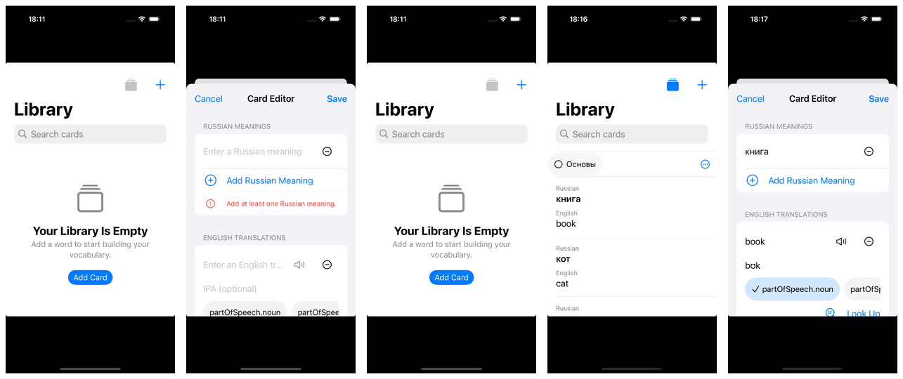
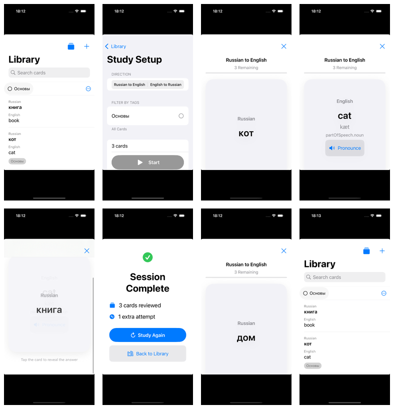
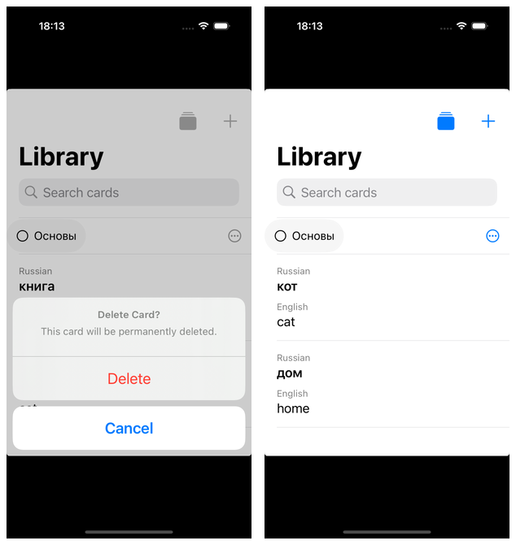

# CardFlipper Flow Walkthrough

Date: 2026-08-10

Environment: iPhone 16 Pro simulator, iOS 18.0, English locale, light appearance

Simulator UDID: `7B66EF3B-2E01-40A2-BD02-EBFCE4606B2B`

## Verdict

- Static navigation audit: **clean**. No dead ends, orphaned entity paths, missing edit path, or nested navigation container in a pushed destination were found. The editor and study flows are modal roots, so each intentionally owns its own `NavigationStack`.
- Automated reachability: **0 failures** in the covered paths.
- F1: **partial**. Empty launch, Add Card reachability, cancel-to-empty, seeded Library, and reopening a prefilled card are covered. Full multi-value creation, tag creation, save, bilingual UI search, edit mutation, and save are manual residue.
- F2: **pass**. Direction selection, reveal, forget/requeue, remember, results, repeat, and finish-to-Library are covered end to end.
- F3: **partial**. Confirmed deletion and immediate Library refresh are covered. Force-termination/relaunch persistence and transient-session reset remain manual because the UI-test launch mode deliberately uses an isolated in-memory store.
- Human discoverability was **not claimed** by automation; the manual checklist below preserves those observations for a person.

## Automation

The app accepts DEBUG-only UI-test arguments:

- `-uiTesting` selects an isolated in-memory SwiftData store.
- `-uiTestSeed` inserts three deterministic cards (`книга/book`, `кот/cat`, `дом/home`) with stable IDs and the `Основы` tag.

Stable accessibility identifiers cover Library, editor fields and actions, study setup, prompt, answer actions, results, repeat, and finish. Production builds do not include the launch configuration or deterministic seed.

Commands used:

```sh
tuist test CardFlipper --no-selective-testing
tuist build CardFlipper
xcodebuild test \
  -workspace CardFlipper.xcworkspace \
  -scheme CardFlipper \
  -only-testing:CardFlipperUITests \
  -destination 'platform=iOS Simulator,id=7B66EF3B-2E01-40A2-BD02-EBFCE4606B2B'
```

## F1 — First launch and editor reachability

Automated assertions:

1. An isolated unseeded launch presents the intentional empty Library state.
2. Add Card presents the editor; Cancel returns to the empty Library.
3. A seeded launch presents vocabulary rows.
4. Tapping the first row opens a prefilled editor whose first Russian value is `книга`.



Manual residue:

- Create a tag and a card with two Russian meanings and two English variants, including IPA and parts of speech.
- Save, search for the card once in Russian and once in English, reopen it, edit a value, save, and confirm the Library reflects it.
- Observe whether tapping a vocabulary row to edit is discoverable without instruction.

## F2 — Study, repeat, and finish

Automated assertions:

1. A seeded Library can open Study, choose Russian-to-English, and start.
2. Tapping the prompt reveals the answer and actions.
3. Don't Remember requeues the card; remembering the resulting queue reaches Results.
4. Repeat starts a fresh session; remembering all cards and Finish returns to Library.



Human check: observe whether tapping the card to reveal it is obvious before relying on the hint.

## F3 — Delete refresh and persistence residue

Automated assertions:

1. Swiping a seeded row exposes Delete.
2. The confirmation is accepted.
3. The Library refreshes from three rows to two without reopening the app.



Manual residue:

- In a normal persistent-store launch, enter Study and force-terminate before completing it.
- Relaunch and confirm vocabulary persists while the transient study/result state does not.
- Observe whether the destructive row action is discoverable without accidental activation.

## Human walkthrough checklist

1. **Create/edit/search:** launch with an empty persistent store; create the full two-by-two card and tag; verify Russian and English search; reopen, edit, and save. Record any hesitation finding row-to-edit.
2. **Study:** complete the forget/requeue/repeat/finish path. Record whether reveal-on-card-tap is understood before reading the hint.
3. **Persistence/reset:** force-terminate mid-study, relaunch, verify vocabulary persistence and transient-session reset, then delete a card. Record any hesitation finding swipe-to-delete and any accidental activation.

Raw `.xcresult`, video, and debug exports are intentionally excluded. Only the selected PNG evidence and filmstrips are retained in the repository.
